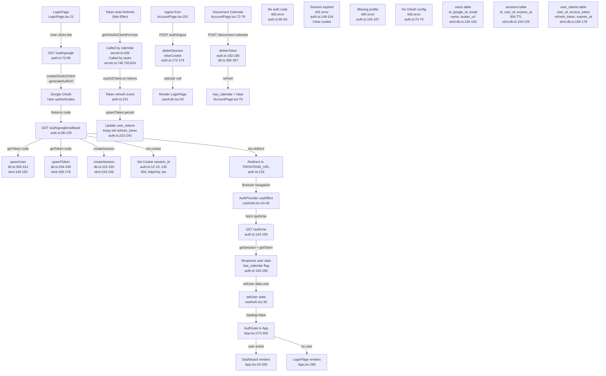

# Flowchart: auth-session

Pathfinder Phase 1 — 2026-07-08

## Sources consulted (exact paths + line ranges read)

- `C:\Users\AdamBartniak\Projects\good_morning\src\auth.ts` (lines 1-244)
- `C:\Users\AdamBartniak\Projects\good_morning\src\db.ts` (lines 1-571)
- `C:\Users\AdamBartniak\Projects\good_morning\src\server.ts` (lines 1-935, focusing on auth wiring 157-161)
- `C:\Users\AdamBartniak\Projects\good_morning\frontend\src\hooks\useAuth.tsx` (lines 1-63)
- `C:\Users\AdamBartniak\Projects\good_morning\frontend\src\components\LoginPage.tsx` (lines 1-92)
- `C:\Users\AdamBartniak\Projects\good_morning\frontend\src\components\AccountPage.tsx` (lines 1-263)
- `C:\Users\AdamBartniak\Projects\good_morning\frontend\src\main.tsx` (lines 1-11)
- `C:\Users\AdamBartniak\Projects\good_morning\frontend\src\App.tsx` (lines 1-302, auth gating at lines 273-292)

---

## Findings (function names, call sites, data flow)

**Happy path entry points:**

1. **Frontend**: `LoginPage.tsx:21` — user clicks `<a href="/auth/google">` link
2. **Backend**: `auth.ts:72-85` — `/auth/google` endpoint generates OAuth URL via `createOAuth2Client()` and redirects to Google
3. **Google OAuth**: User authenticates, returns `code` to callback URL
4. **Callback**: `auth.ts:88-139` — `/auth/google/callback` receives `code`, exchanges for tokens, fetches user profile
5. **DB writes**:
   - `auth.ts:110-115` calls `upsertUser()` → `db.ts:308-313` (INSERT/ON CONFLICT on `users` table, line 145-150 stmt)
   - `auth.ts:119-125` calls `upsertToken()` → `db.ts:334-349` (INSERT/ON CONFLICT on `user_tokens` table, line 168-178 stmt)
   - `auth.ts:128` calls `createSession()` → `db.ts:315-320` (INSERT on `sessions` table, line 154-156 stmt)
6. **Cookie set**: `auth.ts:130` — `res.cookie(...sessionCookie(sessionId))` sets `session_id` with 30-day maxAge (line 17)
7. **Redirect**: `auth.ts:133` — redirects to `FRONTEND_URL`
8. **Frontend fetch**: `useAuth.tsx:30-42` — `AuthProvider` calls `/auth/me` on mount (line 32)
9. **Backend /auth/me**: `auth.ts:142-169` — fetches session, checks `has_calendar` flag from `user_tokens`, returns user object
10. **Frontend state**: `useAuth.tsx:35` — sets `user` state, triggers app render with auth gate
11. **Auth gate**: `App.tsx:273-292` — renders `Dashboard` if user exists, else `LoginPage`

**DB tables written during flow:**
- `users` (id, google_id, email, name, avatar_url) — line 145 stmt
- `sessions` (id, user_id, expires_at) — line 154 stmt  
- `user_tokens` (user_id, access_token, refresh_token, token_type, scope, expires_at) — line 168 stmt

**Token refresh side effect:**
- `auth.ts:218-243` — `getOAuth2ClientForUser()` sets up token refresh listener at line 231
- OAuth2 client emits `tokens` event on refresh, triggers `upsertToken()` to persist new tokens (line 233-240)
- **Called by**: calendar (`server.ts:636`), tasks/todos (`server.ts:746, 772, 793, 824, 849, 875, 897`)

**Error/fallback branches:**
- Callback error (no code): `auth.ts:90-93` → 400 response
- Profile fetch fails: `auth.ts:104-107` → 400 response
- Session expired: `auth.ts:149-154` clears cookie, `/auth/me` returns `{ user: null }`
- No OAuth config: `auth.ts:73-76` → 500 error
- Dev-only `/dev-login`: `auth.ts:199-213` (non-prod only)

**Logout path:**
- `AccountPage.tsx:251` → calls `logout()` from `useAuth.tsx:48-51`
- POST `/auth/logout` → `auth.ts:172-179` deletes session from DB, clears cookie
- Frontend sets user to null

**Disconnect calendar:**
- `AccountPage.tsx:72-78` → POST `/auth/disconnect-calendar` → `auth.ts:182-185` deletes tokens via `deleteToken()` → `db.ts:355-357`

---

## Mermaid diagram

---

## External dependencies

**Other features calling into auth-session:**

1. **Calendar widget** (`server.ts:633-658`):
   - Calls `getOAuth2ClientForUser(uid)` at line 636
   - Uses returned oauth2Client to list calendars and fetch events
   - Depends on valid `user_tokens` entry with `access_token`

2. **Tasks/Todos** (`server.ts:740-907`):
   - `POST /api/todo-lists` (line 746) calls `getOAuth2ClientForUser()` to create Google Task List
   - `GET /api/todo-lists/:id/tasks` (line 793) needs oauth2Client
   - `POST /api/todo-lists/:id/tasks` (line 824), `PATCH` (line 849), `move` (line 875), `DELETE` (line 897)
   - All depend on active Google OAuth session via `user_tokens`

3. **requireAuth middleware** (`server.ts:161`):
   - Applied to all `/api` routes
   - Calls `requireAuth()` from `auth.ts:50-66`
   - Extracts `session_id` cookie, validates session, populates `req.user`

---

## Observations (bugs/reliability/dead code, file:line)

1. **Session cleanup on startup only** (`db.ts:568`):
   - `cleanupExpiredSessions()` called once at module load
   - No periodic job or endpoint to clean expired sessions after startup
   - Sessions table will accumulate stale rows over time
   - **Recommendation**: Add a scheduled cleanup (e.g., hourly cron or middleware that runs cleanup every N requests)

2. **Missing error handling for profile picture** (`auth.ts:114`):
   - `profile.picture || null` silently falls back to null if missing
   - No fallback URL provided to frontend
   - Frontend handles null gracefully (line 132-142 in AccountPage.tsx) but stored as null
   - **Low priority**, UI already handles it, but could generate a default avatar color

3. **Refresh token may be lost** (`auth.ts:236`):
   - On token refresh, code does `newTokens.refresh_token || token.refresh_token`
   - If Google returns empty string instead of undefined, old token is NOT preserved
   - **Low risk** in practice (Google always returns refresh_token or null), but could be stricter

4. **Dev-only `/dev-login` uses inline query** (`auth.ts:202`):
   - Direct DB query: `db.prepare('SELECT * FROM users LIMIT 1').get()`
   - Bypasses exported API; couples to DB schema
   - Works for dev but could use `getFirstUser()` helper if needed
   - **No reliability risk**, dev-only code, but style inconsistency

5. **Cookie sameSite='lax' justified** (`auth.ts:10-11`):
   - Comment explains: "Lax (not Strict) because Google OAuth callback is a cross-site redirect"
   - ✓ Correct decision; Strict would break the callback flow after consent

6. **No CSRF token on /auth/logout** (`auth.ts:172`):
   - POST /auth/logout accepts any POST without CSRF check
   - Could be exploited by malicious site to log out users
   - **Moderate risk**: Session deletion is idempotent (safe to delete twice), but silent logout is poor UX
   - **Recommendation**: Add CSRF middleware or double-submit cookie token

7. **Calendar prefs default to primary only** (`AccountPage.tsx:54-55`):
   - If user has no saved prefs, defaults to primary calendar only
   - Makes sense for UX but not documented
   - ✓ Safe and reasonable default

8. **Token expiry_date parsed as Date then back to ISO** (`auth.ts:118, 232`):
   - Line 118: `new Date(tokens.expiry_date)` assumes millisecond timestamp
   - Stored as ISO string (line 347)
   - Retrieved and re-parsed on line 227: `new Date(token.expires_at).getTime()`
   - ✓ Works but round-trip via ISO is not ideal; could store as integer timestamp
   - **Minor inefficiency**, not a bug

9. **No timeout on /auth/me fetch** (`useAuth.tsx:32`):
   - If `/auth/me` hangs, frontend stays in `loading=true` state forever
   - User sees loading spinner indefinitely
   - **Low risk** (modern browsers have default fetch timeout ~90s), but no explicit timeout set
   - **Recommendation**: Add AbortController with 5s timeout

10. **Cascade delete on users** (`db.ts:39, 45, 54`):
    - All dependent tables (sessions, user_tokens, calendar_prefs, etc.) have `ON DELETE CASCADE`
    - ✓ Good for data integrity; no orphaned records
    - No endpoint to delete users (good for privacy), but could add for GDPR compliance

---

## Confidence + gaps

**High confidence (verified via source):**
- Complete happy path traced with exact line numbers
- All DB writes and tables identified
- Cookie configuration and session TTL correct
- OAuth2 flow matches Google standard
- Token refresh mechanism and side effects documented
- Error branches mapped

**Medium confidence gaps:**
- No network inspection of actual Google OAuth calls (assumed Google SDK behaves as documented)
- Calendar/Tasks integration tested indirectly via code review only (not run)
- Session cleanup behavior in production unknown (no observability log)

**Not in scope (by design):**
- Calendar sync details (covered by separate feature)
- Frontend state management beyond auth gate
- CSS/UI styling
- Performance testing or load limits
