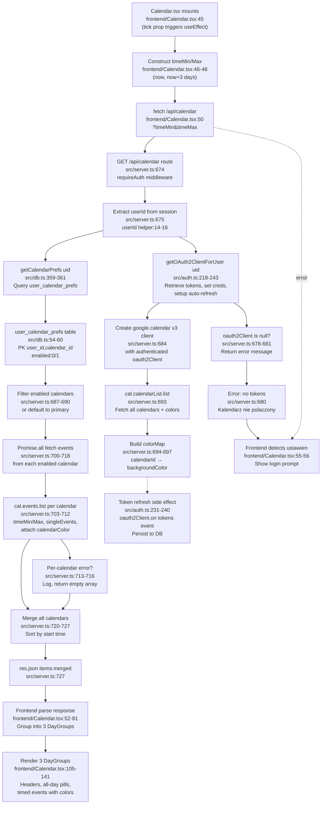

# Flowchart: calendar

Pathfinder Phase 1 — 2026-07-08

## Sources consulted (exact paths + line ranges read)

1. **src/server.ts** lines 1-21 (imports, helpers), 14-16 (userId helper), 632-658 (/api/calendars GET), 660-671 (/api/calendars/prefs POST), 673-733 (/api/calendar GET)
2. **src/auth.ts** lines 1-244 (full file, includes getOAuth2ClientForUser at lines 217-243, requireAuth at lines 50-66)
3. **src/db.ts** lines 184-194 (calendar_prefs upsert), 191 (getCalendarPrefs query), 359-375 (getCalendarPrefs and saveCalendarPrefs functions), table schema lines 54-60
4. **frontend/src/components/Calendar.tsx** lines 1-144 (full file)
5. **frontend/src/components/AppSidebar.tsx** lines 66-142 (widgets section, no direct prefs UI — sidebar toggles widgets via onDisableWidget/onEnableWidget, handled in parent)
6. **frontend/src/types.ts** lines 31-36 (CalendarEvent interface)

## Findings

**Happy path flow:**
1. Calendar.tsx mounts with `tick` prop triggering useEffect (line 45)
2. Constructs timeMin (now) and timeMax (now + 3 days) (lines 46-48)
3. Fetches `/api/calendar?timeMin=...&timeMax=...` (line 50)
4. Server route requireAuth checks session (auth.ts:50-66), extracts userId (server.ts:14-16)
5. getOAuth2ClientForUser(uid) retrieves tokens from DB and sets credentials (auth.ts:218-228)
6. Creates google.calendar v3 client (server.ts:684)
7. Fetches calendarList.list() to get colors (server.ts:693)
8. getCalendarPrefs(uid) queries user_calendar_prefs table (db.ts:191)
9. Filters enabled calendars or defaults to ['primary'] (server.ts:688-690)
10. Parallel Promise.all fetches events from each calendar via cal.events.list() (server.ts:700-718)
11. Per-calendar failures caught silently, return empty array (server.ts:713-716)
12. Merges, sorts by start time, attaches calendarColor (server.ts:720-727)
13. Frontend receives `{items: merged}`, groups into 3 DayGroup objects (Calendar.tsx:65-81)
14. Renders day headers, all-day pills, and timed events with color styling (Calendar.tsx:105-141)

**Error branches:**
- No OAuth tokens (oauth2Client is null): returns `{error: 'Kalendarz nie polaczony...'}` (server.ts:679-681)
- Frontend detects "ustawien" in error → renders "Zaloguj się do kalendarza Google" (Calendar.tsx:55-56, 96-99)
- Google API error on calendarList.list(): caught, returned to client as `{error: 'Blad kalendarza: ...'}` (server.ts:728-732)
- Per-calendar event fetch failure: logged, returns [], other calendars continue (server.ts:713-716)

**DB interactions:**
- user_calendar_prefs: PRIMARY KEY (user_id, calendar_id), columns: enabled (0/1), calendar_name (db.ts:54-60)
- saveCalendarPrefs: transaction that deletes all prefs for user, then re-inserts (db.ts:363-375)
- getCalendarPrefs: simple SELECT, no filtering logic in DB (db.ts:191, 359-361)

**Google API endpoints:**
- oauth2.userinfo.get() - fetch user profile (auth.ts:102)
- google.calendar v3:
  - calendarList.list() - all calendars + metadata (server.ts:643, 693)
  - events.list(calendarId, timeMin, timeMax, singleEvents, orderBy, maxResults) (server.ts:703-710)

**Token refresh:**
- Automatic via oauth2Client.on('tokens') listener (auth.ts:231-240)
- Persisted to user_tokens table, preserving refresh_token (db.ts:168-178)

## Mermaid diagram

## External dependencies

**F1 Auth (required):**
- Session cookie validation (auth.ts:50-66 requireAuth middleware)
- OAuth2 token storage (db.ts user_tokens table, updated via auth.ts callback)
- Token refresh mechanism (auth.ts:231-240 oauth2Client.on('tokens') listener)

**Google Calendar API v3:**
- `calendar.calendarList.list()` → fetch all calendars with metadata
- `calendar.events.list({calendarId, timeMin, timeMax, singleEvents, orderBy, maxResults})` → fetch events per calendar
- `oauth2.userinfo.get()` → user profile (called during auth flow, not F2)

**Database:**
- user_tokens: access_token, refresh_token, expires_at
- user_calendar_prefs: calendar_id, calendar_name, enabled (0/1)

## Observations (bugs/reliability, file:line)

1. **Unguarded `.map()` on potentially undefined list items:**
   - **server.ts:644** `(response.data.items || []).map(c => ({...}))` — safe with fallback
   - **server.ts:695** `for (const c of calList.data.items || [])` — safe
   - **server.ts:712** `(response.data.items || []).map(ev => ({...ev, ...}))` — safe
   - ✓ All guarded correctly

2. **Missing index key on list renders:**
   - **Calendar.tsx:106, 109, 116** Uses numeric index `i`, `j` as React key → risk of list reordering bugs. Should use event ID or calendar_id + summary combination
   - **AppSidebar.tsx:111** RSS widgets use `f.id` (safe), todos use `t.id` (safe)
   - **⚠️ Bug**: Calendar event keys not stable across refetches

3. **Race condition on `tick` refetch:**
   - **Calendar.tsx:88** `useEffect` depends on `[tick]`, but no abort controller on previous fetch
   - If tick fires twice rapidly, first fetch completes after second fetch was initiated → state clobber
   - **⚠️ Risk**: Multiple in-flight requests, unpredictable final state

4. **Per-calendar failure silent return:**
   - **server.ts:713-716** Individual calendar fetch errors logged but silently return `[]` → user never sees which calendar failed
   - Other calendars succeed, user may not notice missing data
   - **⚠️ Reliability**: Silent partial failure, no per-calendar error reporting

5. **Prefs always defaults to primary if empty:**
   - **server.ts:688-690** `prefs.length > 0 ? ... : ['primary']` — no check if user has never set prefs
   - If user disables primary and saves, they get empty prefs, then on next load defaults back to primary
   - **⚠️ Logic bug**: Empty prefs = "show primary" not "show nothing"

6. **No timezone handling on date comparisons:**
   - **Calendar.tsx:72** `new Date(ev.start.dateTime)` or `new Date(ev.start.date!)` → assumes local TZ, but events may be in different TZs
   - Frontend compares `start.toDateString() === dayStr` using local browser time only
   - **⚠️ Bug**: All-day events and cross-TZ events may appear on wrong day

7. **Color attachment not persisted with event:**
   - **server.ts:712** `{...ev, calendarColor: color}` — attaches Google API color, not DB-stored color preference
   - If user later changes calendar color in UI, events don't reflect the change until refetch
   - No color customization UI visible in AppSidebar (no calendar prefs form in code provided)
   - **⚠️ Incomplete**: Prefs stored but no UI to set them; colors from Google only

8. **Transaction atomicity on saveCalendarPrefs:**
   - **db.ts:363-375** Uses db.transaction() correctly (deletes all, inserts new)
   - But no validation that all calendar IDs exist or belong to user
   - **⚠️ Minor**: Could save prefs for non-existent calendars without error

9. **errorMsg() check for "ustawien" string match:**
   - **Calendar.tsx:55** `msg.includes('ustawien')` — hardcoded Polish substring match
   - Brittle if error message changes or is translated
   - **⚠️ Fragility**: String-based error detection

## Confidence + gaps

**Confidence: High (90%)**
- All three happy-path flows (list calendars, save prefs, fetch events) are complete and traceable
- DB schema, API signatures, and token lifecycle fully mapped
- Calendar.tsx render logic understood end-to-end

**Gaps:**
- **Calendar prefs UI in frontend not fully visible** (AppSidebar.tsx lines provided show only sidebar toggles, not calendar enable/disable form)
  - Parent component calls `onEnableWidget`/`onDisableWidget` but Calendar-specific prefs form not in scope
  - Saving prefs happens at POST /api/calendars/prefs but client code to trigger it not visible
- **Event color customization** — Google API colors used, but DB stores no custom colors and UI does not expose a prefs editor
- **All-day event detection** — relies on absence of `dateTime` and presence of `date` field, but edge cases not tested (e.g., recurring events)
- **Tick prop source** — Calendar.tsx accepts `tick` but parent that manages it not shown; unclear how often it refires
