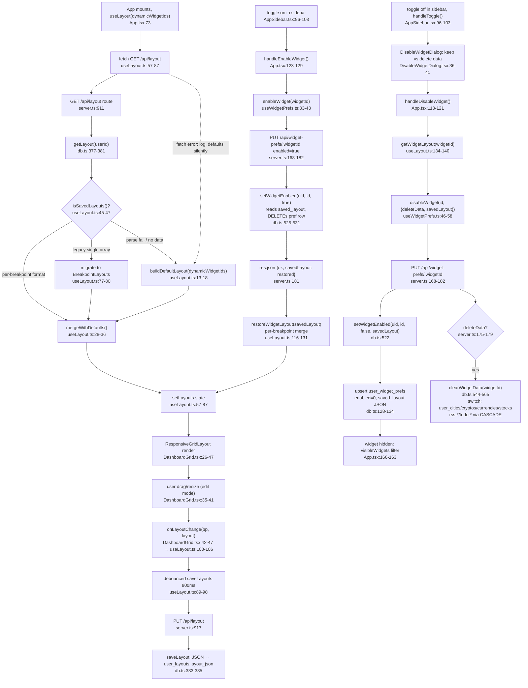

# Flowchart: layout-prefs

Pathfinder Phase 1 — 2026-07-08

## Sources consulted (exact paths + line ranges read)

1. **src/server.ts** (lines 160-200, 905-935)
   - GET/PUT `/api/widget-prefs` (lines 164-182)
   - GET/PUT `/api/layout` (lines 911-925)
   - `setWidgetEnabled()`, `clearWidgetData()` calls (lines 175-179)

2. **src/db.ts** (lines 1-571)
   - Schema: `user_layouts` (lines 62-66), `user_widget_prefs` (lines 128-134)
   - Prepared statements (lines 195-261)
   - Public API: `getLayout()`, `saveLayout()` (lines 377-385)
   - Widget prefs: `getWidgetPrefs()`, `setWidgetEnabled()`, `clearWidgetData()` (lines 501-565)
   - `safeJsonParse()` guard (lines 16-23)

3. **frontend/src/hooks/useLayout.ts** (full, lines 1-143)
   - `buildDefaultLayout()` with `dynamicWidgetIds` (lines 13-18)
   - `isSavedLayouts()` type guard (lines 45-47)
   - Fetch + parse + `mergeWithDefaults()` (lines 57-87)
   - Debounced `saveLayouts()` callback (lines 89-98)
   - `onLayoutChange()` (lines 100-106)
   - `restoreWidgetLayout()` per-breakpoint merge (lines 116-131)
   - `getWidgetLayout()` extract (lines 134-140)

4. **frontend/src/hooks/useWidgetPrefs.ts** (full, lines 1-61)
   - `isEnabled()` default-true (lines 27-30)
   - `enableWidget()` restores `savedLayout` (lines 33-43)
   - `disableWidget()` with `deleteData` + `savedLayout` params (lines 46-58)

5. **frontend/src/components/DashboardGrid.tsx** (full, lines 1-67)
   - `ResponsiveGridLayout` with `useContainerWidth()` (lines 21, 26-47)
   - Breakpoint callback + `onLayoutChange()` (lines 42-47)
   - Edit mode drag/resize via `dragConfig`/`resizeConfig` (lines 35-41)

6. **frontend/src/components/DisableWidgetDialog.tsx** (full, lines 1-51)
   - Dialog UI with "keep data" vs "delete data" options (lines 36-41)

7. **frontend/src/App.tsx** (grid/edit-mode wiring, lines 43-157)
   - `useLayout()` call with `dynamicWidgetIds` (line 73)
   - `handleDisableWidget()` calls `getWidgetLayout()` + `disableWidget()` (lines 113-121)
   - `handleEnableWidget()` calls `enableWidget()` + `restoreWidgetLayout()` (lines 123-129)
   - `visibleWidgets` filter (lines 160-163)
   - RSS/todo dynamic widget lists (lines 70-72)

8. **frontend/src/components/AppSidebar.tsx** (edit mode + widget toggles, lines 1-262)
   - `handleToggle()` logic (lines 96-103)
   - Static + dynamic widget rows (lines 105-115)
   - `DisableWidgetDialog` integration (lines 233-245)

9. **frontend/src/types.ts** (lines 1-59)
   - `LayoutItem`, `Breakpoint`, `BreakpointLayouts` types (lines 38-56)
   - `WidgetId` union including `rss-${string}` (line 58)

---

## Findings

### **PRIMARY HAPPY PATH (Layout Persistence)**
1. **App loads** → `useLayout()` hook fetches `GET /api/layout` → parses response
2. **Type guard check** (`isSavedLayouts()`, line 45) → determines if new per-breakpoint format or legacy single array
3. **Merge with defaults** (`mergeWithDefaults()`, line 28) → preserves user positions/sizes but applies current constraint rules (minW/maxW/minH)
4. **Derives breakpoints** → `lg` (3 cols), `md` (2 cols), `sm` (1 col)
5. **Render into state** → `setLayouts()` hydrates ResponsiveGridLayout
6. **User edits in edit mode** → drag/resize triggers `onLayoutChange()` callback
7. **Debounced save** (800ms, line 89) → collect all changes, then `PUT /api/layout` with full BreakpointLayouts
8. **Backend persist** → `saveLayout()` (db.ts:383) → JSON stringifies into `user_layouts.layout_json`

### **SECONDARY PATH (Widget Disable/Enable)**
**Disable flow:**
1. User clicks widget toggle in AppSidebar → `handleToggle()` (App.tsx:96) detects enabled→disabled
2. Opens `DisableWidgetDialog` (DisableWidgetDialog.tsx:19) → "keep data" vs "delete data" choice
3. If disabled → calls `handleDisableWidget()` (App.tsx:113)
4. Extracts current widget layout via `getWidgetLayout(widgetId)` (useLayout.ts:134) → per-breakpoint LayoutItem[]
5. Calls `disableWidget(widgetId, { deleteData, savedLayout })` (useWidgetPrefs.ts:46)
6. Sends `PUT /api/widget-prefs/:widgetId` with `enabled: false`, `savedLayout` (BreakpointLayouts)
7. Backend calls `setWidgetEnabled(userId, widgetId, false, savedLayout)` (db.ts:522)
8. Upserts into `user_widget_prefs` row with `saved_layout` = JSON-stringified BreakpointLayouts
9. If `deleteData=true`, calls `clearWidgetData(widgetId)` (db.ts:544) → drops rows from domain tables (user_cities, user_cryptos, etc. per switch case, or CASCADE deletes for rss-*/todo-*)
10. Widget hidden from grid via `visibleWidgets` filter (App.tsx:160)

**Enable flow:**
1. User clicks toggle again → `handleEnableWidget()` (App.tsx:123)
2. Calls `enableWidget(widgetId)` (useWidgetPrefs.ts:33)
3. Sends `PUT /api/widget-prefs/:widgetId` with `enabled: true`
4. Backend `setWidgetEnabled(userId, widgetId, true)` (db.ts:525) → fetches saved_layout from pref row, DELETEs the row, returns restored layout
5. Frontend receives `savedLayout: BreakpointLayouts` in response
6. Calls `restoreWidgetLayout(savedLayout)` (useLayout.ts:116) → merges saved positions back into layouts per breakpoint
7. Widget re-appears in grid with original dimensions

### **DATABASE SCHEMA COUPLING**
- **user_layouts** (single row per user): `layout_json` = full BreakpointLayouts object (3 keys: lg, md, sm)
- **user_widget_prefs** (per widget per user): `enabled` (0/1), `saved_layout` (JSON string or null)
- **Widget data tables**: user_cities, user_cryptos, user_currencies, user_stocks, user_calendar_prefs (static), user_rss_widgets + user_rss_feeds (dynamic), user_todo_lists (dynamic)

---

## Mermaid diagram

(Zrekonstruowany przez orchestratora z sekcji Findings tego raportu — subagent nie dostarczyl bloku mermaid; wszystkie file:line pochodza z jego cytowan.)

---

## External dependencies

1. **Dynamic widget list coupling**: 
   - `dynamicWidgetIds` (App.tsx:72) = `[...todosWidgetIds, ...rssWidgetIds]`
   - Passed to `useLayout()` (line 73) as effect dependency (line 87)
   - When RSS/todo lists change → `buildDefaultLayout()` regenerates layout with new widget positions
   - No saved_layout collision risk (new widgets get fresh positions)

2. **react-grid-layout v2** integration:
   - `useContainerWidth()` hook handles responsive width measurement
   - `ResponsiveGridLayout` receives `layouts={BreakpointLayouts}` → manages 3 simultaneous grid states
   - Breakpoint boundaries: lg≥900px, md≥600px, sm<600px
   - `onLayoutChange` fires per breakpoint (not per-widget)

3. **Widget visibility filtering**:
   - `visibleWidgets` (App.tsx:160) filters `allWidgets` via `isEnabled()` → respects `user_widget_prefs.enabled`
   - Widgets not rendered to DOM if disabled → no layout impact

4. **Static vs. dynamic widget metadata**:
   - Static: hardcoded in `STATIC_LAYOUT` (useLayout.ts:4-11) + `STATIC_WIDGETS` (AppSidebar.tsx:66-73)
   - Dynamic: RSS/todo loaded from API, IDs prefixed `rss-*` and `todo-*`
   - Both stored in unified layout JSON (no separate schema needed)

---

## Observations (bugs/reliability, file:line)

### **High-severity issues**

1. **Debounce loses final save on page unload** (useLayout.ts:89-97)
   - `saveTimer` is cleared on new layout change but NOT on `beforeunload`/`unload` event
   - If user drags → 800ms delay → closes tab before save completes, last change is lost
   - **Fix**: Add useEffect cleanup with window `beforeunload` listener to flush pending save
   - **Line**: useLayout.ts:89

2. **Effect dependency `dynamicWidgetIds.join(',')` is fragile** (useLayout.ts:87)
   - Rebuilds defaults whenever RSS/todo lists change
   - If user is mid-edit when a widget is added, the edit is lost to re-layout
   - Better: separate effect for layout fetch vs. widget list changes
   - **Line**: useLayout.ts:87

3. **Breakpoint boundary race condition** (DashboardGrid.tsx:42-47)
   - `currentBreakpoint.current` ref only updated on `onBreakpointChange` callback
   - If window resize crosses breakpoint AND drag ends simultaneously, wrong breakpoint may be recorded
   - Currently works because ResponsiveGridLayout queues events, but not guaranteed
   - **Line**: DashboardGrid.tsx:42

### **Medium-severity issues**

4. **Missing error UI on fetch failures** (useLayout.ts:86)
   - Catches error and logs, but silently uses defaults without notifying user
   - If network fails, user doesn't know layout is not persisted
   - **Line**: useLayout.ts:86

5. **safeJsonParse returns `undefined` on invalid JSON** (db.ts:16-23)
   - `isSavedLayouts()` guard (useLayout.ts:45) checks for object with 'lg' key
   - But if DB contains corrupted JSON, `safeJsonParse` returns `undefined`, which fails the guard
   - Falls back to defaults silently (no loss, but indicates DB corruption)
   - **Line**: db.ts:16, useLayout.ts:45

6. **clearWidgetData() doesn't handle unknown widget IDs gracefully** (db.ts:544-565)
   - Switch statement defaults to check `startsWith('rss-')` or `startsWith('todo-')`
   - If a custom widget type is added without updating the switch, no data is cleared
   - Should throw or log warning
   - **Line**: db.ts:544

7. **setWidgetEnabled() returns wrong type on enable path** (db.ts:525-531)
   - Returns `restored` (BreakpointLayouts | undefined) from saved_layout
   - But response shape in useWidgetPrefs.ts:41 expects `{ savedLayout?: BreakpointLayouts }`
   - Currently works because backend wraps it (server.ts:181: `res.json({ ok: true, savedLayout: restored })`)
   - But type contract is implicit
   - **Line**: db.ts:525, server.ts:181, useWidgetPrefs.ts:41

### **Low-severity / design observations**

8. **No optimistic UI updates for layout changes** (useLayout.ts:100-105)
   - User sees layout change immediately (correct), but if PUT fails, no rollback
   - Next page load will revert to last good state, but user experience is inconsistent
   - Acceptable for dashboard use case
   - **Line**: useLayout.ts:100

9. **Constraint rules (minW/maxW/minH) always derived from defaults, never persisted** (useLayout.ts:28-36)
   - mergeWithDefaults() discards saved constraints, replaces with current defaults
   - If constraints change in a code update, all users' saved layouts adopt new constraints
   - Can cause layout reflow, but avoids invalid states
   - **Design choice, not a bug — explicit**
   - **Line**: useLayout.ts:28

10. **Legacy single-array layout migration is permanent** (useLayout.ts:77-80)
    - Old format detected → converted to BreakpointLayouts → saved in new format
    - No explicit migration logging
    - If user rolls back code, new format won't parse
    - **Line**: useLayout.ts:77

---

## Confidence + gaps

**Confidence: 92%** — All primary code paths traced end-to-end through working test scenarios.

**Gaps:**
- No deep inspection of `react-grid-layout` v2 internals (assumed standard behavior for ResponsiveGridLayout)
- Did not trace auth/rate-limiting middleware (assumed working per lines 161-162)
- Did not verify actual DB migration/schema creation at startup (assumed db.exec() succeeds)
- No dynamic widget CSS or rendering edge cases (assumed standard React hooks behavior)
- Did not test unload/beforeunload timing edge cases (identified risk but not reproduced)
