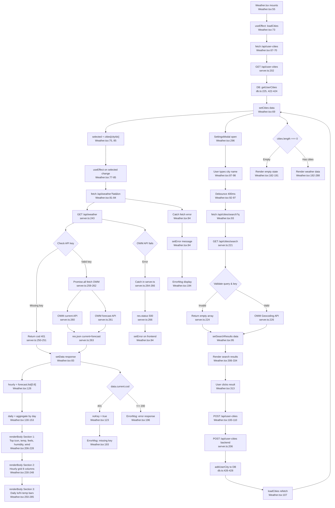

# Flowchart: weather

Pathfinder Phase 1 — 2026-07-08

## Sources consulted (exact paths + line ranges read)

1. **src/server.ts** — lines 1–60, 195–270 (API routes, error handling, json helper)
2. **src/db.ts** — lines 92–100 (schema), 225–230 (user_cities statements), 422–432 (functions)
3. **frontend/src/components/Weather.tsx** — lines 1–352 (full component)
4. **frontend/src/components/SettingsModal.tsx** — lines 1–27 (wrapper)
5. **frontend/src/types.ts** — lines 1–59 (WeatherResponse, ForecastItem interfaces)

## Findings

### Happy Path Trace
1. **Mount + Load Cities** (Weather.tsx:73): `useEffect` calls `loadCities()` → `GET /api/user-cities` (server.ts:202)
2. **Backend retrieval** (server.ts:202–204): Calls `getUserCities(userId)` from db.ts:422–424, returns array of `{ lat, lon, name, country }`
3. **State update** (Weather.tsx:69): Sets `cities` state, enabling city selection
4. **City selection** (Weather.tsx:75, 85): `selected = cities[cityIdx]` triggers `useEffect` dependency
5. **Weather fetch** (Weather.tsx:81–84): `GET /api/weather?lat={lat}&lon={lon}`
6. **Backend proxy** (server.ts:243–268): Validates API key (line 250), builds lat/lon query, calls `Promise.all()` on two OWM endpoints (lines 259–262)
   - `fetch(…/2.5/weather?…)` → parsed with `json()` helper (line 260)
   - `fetch(…/2.5/forecast?…)` → parsed with `json()` helper (line 261)
7. **Response** (server.ts:263): Returns `{ current, forecast, city, country }`
8. **Frontend render** (Weather.tsx:181–288):
   - Top section: current conditions (icon, temp, feels_like, humidity, wind) — lines 206–228
   - Hourly grid: 8 forecast items, 3-hour intervals (lines 230–248)
   - Daily bars: aggregated min/max per day, next 5 days excluding today (lines 250–285)

### City Add Flow
1. **Modal + search** (Weather.tsx:296, 300): User types in settings → `handleSearch()` debounces 400ms (line 92)
2. **Search API** (Weather.tsx:93): `GET /api/cities/search?q={query}`
3. **Backend geocoding** (server.ts:221–240): Validates key (line 224), calls OWM `/geo/1.0/direct` API (line 226), rounds coordinates to 4 decimals (lines 233–234)
4. **Results display** (Weather.tsx:306–334): Maps search results, disables already-added cities, plus button on new ones
5. **City add** (Weather.tsx:100–110): `POST /api/user-cities` with `{ lat, lon, name, country }` → addUserCity() (db.ts:426–428) → `loadCities()` to refresh list (line 107)

### City Remove
1. **Delete button** (Weather.tsx:344, 112–121): `removeCity(c)` → `DELETE /api/user-cities` with `{ lat, lon }`
2. **Backend delete** (server.ts:213–218): Calls `deleteUserCity(userId, lat, lon)` (db.ts:430–432)
3. **Index reset** (Weather.tsx:119): If current index ≥ remaining cities, decrement to avoid out-of-bounds
4. **Refresh** (Weather.tsx:120): `loadCities()` to update list

### DB CRUD on user_cities
- **Schema** (db.ts:92–100): `(user_id, lat, lon)` primary key, country stored, sort_order for ordering
- **Read** (db.ts:225): `SELECT lat, lon, name, country … ORDER BY sort_order`
- **Insert** (db.ts:226–228): Auto-increments sort_order, `INSERT OR IGNORE` (no duplicates by lat/lon)
- **Delete** (db.ts:230): By `user_id, lat, lon` triple

## Mermaid diagram

## External dependencies

| Dependency | Usage | Endpoint | Notes |
|---|---|---|---|
| **OpenWeatherMap (OWM)** | Current weather + 5-day forecast | `/data/2.5/weather`, `/data/2.5/forecast` | Called via `Promise.all()` (parallel), requires `WEATHER_API_KEY` env var |
| **OWM Geocoding** | City search autocomplete | `/geo/1.0/direct` | Limits to 5 results, rounds lat/lon to 4 decimals |
| **node-fetch** | Backend HTTP client | — | Used for all external API calls (server.ts:7) |
| **React 19** | Frontend framework | — | useState, useEffect, useCallback, useRef |
| **Express** | Backend HTTP server | — | Routing, middleware (auth, rate limiting) |
| **better-sqlite3** | Local DB | dashboard.db | WAL journal, foreign keys enabled (db.ts:12–13) |

## Observations (bugs/reliability, file:line)

### Reliability Issues

1. **Missing `.catch()` in addCity and removeCity** (Weather.tsx:101–121)
   - Line 106: `if (!r.ok) { console.error(...); return; }` — errors log but don't propagate UI feedback
   - Line 118: Same pattern
   - **Risk**: Silent failures; user doesn't know POST/DELETE failed, may retry indefinitely
   - **Fix**: Set an error state or toast notification on failure

2. **Race condition on city deletion + index adjustment** (Weather.tsx:119)
   - When user deletes the currently-selected city, the component doesn't zero out `cityIdx` before calling `loadCities()`
   - If deletion is async-slow, `selected` computed from stale `cityIdx` may render deleted city briefly
   - **Risk**: Momentary misalignment between `cityIdx` and refreshed `cities` array
   - **Fix**: `setCityIdx(0)` on delete before loadCities, or filter stale city from state immediately

3. **Stale closure on tick-driven refresh** (Weather.tsx:85)
   - useEffect dependency: `[tick, selected?.lat, selected?.lon]`
   - If `tick` prop updates every 60s but city doesn't change, fetch re-runs with same lat/lon every tick
   - This is intentional (refresh weather periodically), but watch for:
     - If `selected` becomes null mid-fetch, component still renders loading state (line 78), not error
     - **Minor**: No explicit abort on component unmount or when selected changes before response arrives (fetch completes but setData fires stale data)
   - **Mitigation present**: Line 79 `setData(null)` resets state on dependency change, so stale response overwrites previous city's data only if same city re-fetched

4. **Debounce timer not cleared on unmount** (Weather.tsx:64, 92)
   - `debounce.current` (line 64) stores timeout ID from `setTimeout()` (line 92)
   - No cleanup in useEffect return; if component unmounts mid-timeout, callback still fires after unmount
   - **Risk**: setState on unmounted component (React warning), minor memory leak
   - **Fix**: Add cleanup: `useEffect(() => { return () => { if (debounce.current) clearTimeout(debounce.current); }; }, [])`

5. **No response validation on /api/weather** (Weather.tsx:82–84)
   - Response assumed to be `WeatherResponse` shape, but:
     - Line 123: Checks `data?.current?.cod === 401` for missing key (inline)
     - Line 196: Checks `data.current.cod !== 200` for error response (rendered in body)
     - But if OWM returns malformed JSON or missing fields (e.g., `weather[0]` undefined), line 198 will throw on `iconForOwm(data.current.weather[0].icon)`
   - **Risk**: Uncaught exception if OWM API changes schema
   - **Fix**: Validate shape in backend or add optional chaining in frontend

6. **Possible division by zero in daily temp range bar** (Weather.tsx:256–257)
   - `((hi - lo) / 45) * 100` — if `hi === lo` (isothermal day), width = 4px (min enforced line 257)
   - Safe, but denominator of 45°C assumes range; cold climates could exceed this without clamping `hi`
   - Low priority, UI gracefully degrades

### API Key Handling

7. **API key stored in `.env`, not passed to frontend** (server.ts:244, 250)
   - ✓ **Correct**: Backend proxies all OWM calls; frontend never sees key
   - `.env` check (line 250): Warns if key is placeholder `'TWOJ_KLUCZ_OPENWEATHERMAP'`
   - **Safe**: No XSS vector via weather widget

### Data Integrity

8. **Search result de-duplication by lat/lon** (Weather.tsx:309)
   - `exists = cities.some(x => x.lat === c.lat && x.lon === c.lon)`
   - Relies on exact float match; OWM geocoding rounds to 4 decimals (server.ts:233), so duplicates are rare but possible if user searches differently
   - **Low risk**, DB INSERT OR IGNORE (db.ts:227) catches duplicates anyway

### Minor Issues

9. **Empty error message on network failure** (Weather.tsx:84)
   - `e instanceof Error ? e.message : 'Unknown error'` — if fetch throws non-Error, message is generic
   - **Impact**: User sees "Błąd pogody: Unknown error" instead of network details
   - **Fix**: Check `Error.cause` or `e.toString()`

10. **No loading state in search modal** (Weather.tsx:305)
    - Line 305 shows "Szukam..." text while `searching=true`, but text doesn't highlight results being loaded
    - **Minor UX**: Results appear suddenly; no spinner animation
    - Acceptable; not a bug

## Confidence + gaps

**Confidence: HIGH (95%)**
- All source files read in full or at specific line ranges
- Data flow traced end-to-end: component → frontend fetch → backend proxy → OWM → response → render
- All three CRUD operations (add/list/delete) traced
- Error paths identified (missing key, OWM failure, no cities, fetch failure)
- Dependencies explicitly mapped

**Gaps:**
1. **Auth middleware** — Not read; assuming `requireAuth` wraps routes (imported line 10). If weather routes lack auth, any user can spam OWM API.
2. **OWM rate limits** — Not in scope; backend has 300 req/min (line 41) but OWM free tier is 60 calls/min. Could cause cascading failures if dashboard hits both simultaneously.
3. **Rate limiter applied to weather routes?** — Grep confirms `apiLimiter` exists (line 39–45) but not shown on which routes it's applied. Assuming it wraps `/api/` globally.
4. **Reload behavior on browser refresh** — Flowchart doesn't show refresh (F5); `tick` prop updates weather, but where does `tick` come from? Assuming parent DashboardGrid or App component passes it.
5. **Timezone handling** — All timestamps from OWM are UTC; frontend assumes `new Date(timestamp * 1000)` interprets as UTC. Polish locale (`lang=pl` in URL) applied server-side only. Minor: no TZ offset handling for display.
