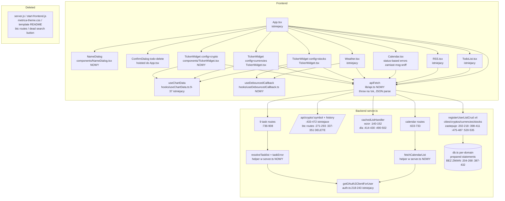

# 03 — Unified Proposal

Data: 2026-07-08. Autor: orchestrator (synteza wlasna, nie delegowana). Zasada: najprostsza unifikacja — usuwanie ponad abstrakcje, jedna sciezka ponad konfigurowalne sciezki. Odrzucone anty-wzorce: nowe warstwy "for flexibility", feature flagi, registry tam gdzie starczy switch.

Kazdy system ponizej mapuje sie na duplikacje z `02-duplication-report.md` (D1-D11).

---

## U0. Dead code — czyste usuniecie (z 00-features.md + D5)

Zero abstrakcji, sam delete:

| Plik / route | Powod |
|---|---|
| `server.js` (root, 103 ln) | legacy backend port 3000, klucze w query params, RSS bez SSRF; zero referencji |
| `start-frontend.js` (root) | nieuzywany launcher; zero referencji |
| `frontend/src/template/metrica-theme.css` + `template/README.md` | martwe (tokeny w index.css); AppShell.tsx ZOSTAJE (uzywany przez App.tsx) |
| routes `/api/btc` (server.ts:271-293) i `/api/btc/history` (:337-351) | frontend nie wola ich nigdzie (grep-verified); `/api/crypto/:symbol` pokrywa BTC |
| import `useCallback` w Crypto.tsx:1, Currencies.tsx:1, Stocks.tsx:1 | nieuzywany |
| martwy przycisk search DashboardHeader.tsx:78-84 | brak onClick, brak funkcji |

Utrata zdolnosci: pola `highestBid`/`lowestAsk` (server.ts:284-285) znikaja — nikt ich nie konsumuje. Akceptowalne.

## U1. `TickerWidget` — jeden komponent zamiast trio (D1)

**Komponent:** `frontend/src/components/TickerWidget.tsx`. **Entry point:** `<TickerWidget config={...} tick={tick} />`.

Config (dyskryminowany prosty obiekt, NIE registry):

```ts
type TickerConfig = {
  title: string;
  icon: ReactNode;
  keyField: 'symbol' | 'code';
  listUrl: string;          // /api/user-cryptos itd.
  priceUrl: (key: string) => string;
  historyUrl: (key: string, days: number) => string;
  fmt: (v: number) => string;          // delta: isBig BTC, 4 miejsca waluty
  picker: { kind: 'available'; url: string } | { kind: 'search'; url: (q: string) => string }; // delta: Stocks
  gradientId: string;
};
```

Stare call sites:
- `Crypto.tsx` (188 ln) → `<TickerWidget config={CRYPTO_CONFIG} />` (config ~15 ln)
- `Currencies.tsx` (185 ln) → jw.
- `Stocks.tsx` (200 ln) → jw.
- Configi w jednym pliku `tickerConfigs.tsx` albo inline w App.tsx — bez osobnego pliku per config.

Przy okazji naprawia (raz zamiast x3): brak `.catch` na mount (D3), stale `active` closure przy remove, `fmtPLN(s.price!)` non-null assertion, unifikacja debounce przez U6.

Utrata zdolnosci: zadna — wszystkie delty (isBig, decimals, search-vs-list, symbol-vs-code) jawnie w configu. Ryzyko: srednie; mityguje code-review + reczny test 3 widgetow.

## U2. `apiFetch` — jedna obsluga bledow HTTP na froncie (D3)

**Komponent:** `frontend/src/lib/api.ts`. **Entry point:** `apiFetch<T>(url, init?): Promise<T>` — rzuca `Error` na `!res.ok` (z trescia z serwera gdy jest), parsuje JSON.

Stare call sites (D3 pelna lista):
- mutacje silent-fail: Weather.tsx:100-121, RSS.tsx:70-90, TodoList.tsx:102-132, App.tsx:85-111, useWidgetPrefs.ts:40,:57 → `await apiFetch(...)` w try/catch, catch ustawia widoczny blad (istniejacy `ErrorMsg` / inline komunikat — bez nowej biblioteki toastow, KISS)
- brak .catch: Crypto/Currencies/Stocks mount (naprawione w U1), RSS.tsx:63 → `.catch` z error-state
- idiom `fetch().then(r => { if (!r.ok) throw ... })` wszedzie → `apiFetch`

Swiadomie POZA zakresem: AbortController wszedzie (duza zmiana, maly zysk — tick co 15 min; dodac tylko w `useDebouncedCallback`-owanych wyszukiwaniach jesli tanio). Quote.tsx zostaje na swoim fallbacku (legit specjalizacja).

Utrata zdolnosci: zadna. Zysk: 3 wieczne loadingi i ~12 cichych porazek staja sie widocznymi bledami.

## U3. Backend: `resolveTasklist` + spojne kody bledow (D2)

**Komponenty (w server.ts, bez nowych plikow):**
- `resolveTasklist(req, res): Promise<{ tasks: tasks_v1.Tasks, tasklistId: string } | null>` — robi lookup listy + oauth + konstrukcje klienta; pisze 4xx i zwraca null przy braku.
- `taskError(res, label, e)` — jeden catch-block.

Stare call sites: server.ts:820-825, :845-850, :871-876, :893-898 (preambuly) → 1 linia; :749, :775, :797, :828, :853, :879, :901 (konstrukcje klienta) → w helperze; :834-837, :863-866, :886-889, :904-907 (catche) → `taskError`.

Unifikacja error-shape: `{error}` z HTTP 200 (server.ts:680, :731, :791, :794, :811) → wlasciwe kody: 401 brak tokenow, 400 brak listy, 502 blad Google. **Zmiana skoordynowana z frontendem:** Calendar.tsx:53-62 przestaje sniffowac `msg.includes('ustawien')` — rozroznia po statusie (401 → "Zaloguj sie do kalendarza Google"). GET /api/tasks zachowuje soft-wariant (server.ts:788-794, legit specjalizacja) — pusta lista zamiast crasha widgetu.

Bonus: `fetchCalendarList(auth)` helper dla server.ts:633-658 vs :674-733 (mapowanie koloru w jednym miejscu).

Utrata zdolnosci: zadna. Ryzyko: niskie — odpowiedzi happy-path bez zmian; zmieniaja sie tylko kody bledow (frontend dostosowany w tym samym kroku).

## U4. `registerUserListCrud` — jedna rejestracja x4 domeny (D4)

**Komponent:** funkcja w server.ts (nie nowy plik):

```ts
function registerUserListCrud(path: string, ops: {
  list: (uid: number) => unknown[];
  add: (uid: number, body: unknown) => void;   // walidacja fail-fast w srodku
  remove: (uid: number, req: Request) => void; // cities czyta lat/lon z body
}) { /* GET/POST/DELETE z jednolita walidacja→400 */ }
```

Stare call sites: server.ts:202-218 (cities), :398-411 (cryptos), :475-487 (currencies), :520-535 (stocks) → 4 wywolania rejestracji. **db.ts BEZ zmian** (prepared statements zostaja per-domain — legit).

Swiadomie NIE: generyczny SQL po nazwach tabel (walka z typowaniem better-sqlite3, powierzchnia injection). Niespojnosc cities body-vs-param zostaje (composite key; zmiana API bez zysku).

Utrata zdolnosci: zadna. 4 powtorzenia — przekracza prog projektu "abstrakcja przy 3+".

## U5. Drobne konsolidacje frontendu (D6, D7, D8, D10, D11)

Bez nowych warstw, kazde to hoist albo fix-in-place:

1. **ConfirmDialog todo-delete:** hoist do App.tsx ze stanem `deleteListTarget`; TodoList.tsx:351-365 i AppSidebar.tsx:247-259 tylko ustawiaja target (oba juz maja callback z App.tsx:107-111 przez :147,:189).
2. **`NameDialog`** (`frontend/src/components/NameDialog.tsx`): App.tsx:211-238 (RSS) i :239-266 (Todo) → 2 wywolania z propsami `{open, title, placeholder, onSubmit, onClose}`.
3. **`useDebouncedCallback(fn, ms)`** (`frontend/src/hooks/useDebouncedCallback.ts`): Weather.tsx:87-98 + Stocks.tsx:66-77 (potem w U1 config search); jeden delay 300ms; cleanup na unmount naprawia wyciek.
4. **Stabilne React keys (fix in place, bez abstrakcji):** Calendar.tsx:106,:109,:131 (→ `ev.id`, dla dni `day.label`); RSS.tsx:104-105 (→ `article.link`); Weather.tsx:236,:260,:312 (→ timestamp/`city.lat,lon`).
5. **`defaultBreakpointLayouts(ids)`** one-liner w useLayout.ts (kompozycja :50-51,:58-59,:108-111).
6. **Frontend chart TTL:** config.ts:10 z 30 min → 5 min + komentarz o sprzezeniu z cache backendu (server.ts:91) — likwiduje ~60-min worst-case staleness.
7. **`cachedListHandler`** w server.ts wzorem `cachedHistoryHandler` (:140-152) dla :414-430 i :490-502.

Odlozone (wartosc marginalna, nie robic teraz): wspolny Avatar x3 (delty stylistyczne), `resolveSession` w auth.ts (rozne terminale), unifikacja generateAuthUrl (auth.ts:78-84 vs :189-195 — najpierw decyzja produktowa czy calendar-connect ma miec wezszy scope; zostawic TODO-komentarz).

---

## Combined Mermaid — proponowany stan docelowy



## Priorytet wdrozenia (rekomendacja orchestratora)

1. **U0** — dead code delete (zero ryzyka, natychmiast)
2. **U1 (+U5.3)** — TickerWidget: najwiekszy payoff (~280 ln + 4 klasy bugow x3)
3. **U2 (+U5.4)** — apiFetch + keys: naprawia ~15 realnych defektow niezawodnosci
4. **U3** — backend tasks/calendar hygiene + error-shape
5. **U4 + U5 reszta** — oportunistycznie

**Najlepszy kandydat na cykl make-plan → do → code-review: U1+U0** (trio → TickerWidget + dead code). Uzasadnienie: flagowe znalezisko audytu (duplikacja), najwiekszy zysk liniowy, przy okazji naprawia zduplikowane x3 bugi; ryzyko srednie mitygowane przez code-review w cyklu. Runner-up: U2 (czysta niezawodnosc, nizsze ryzyko).
